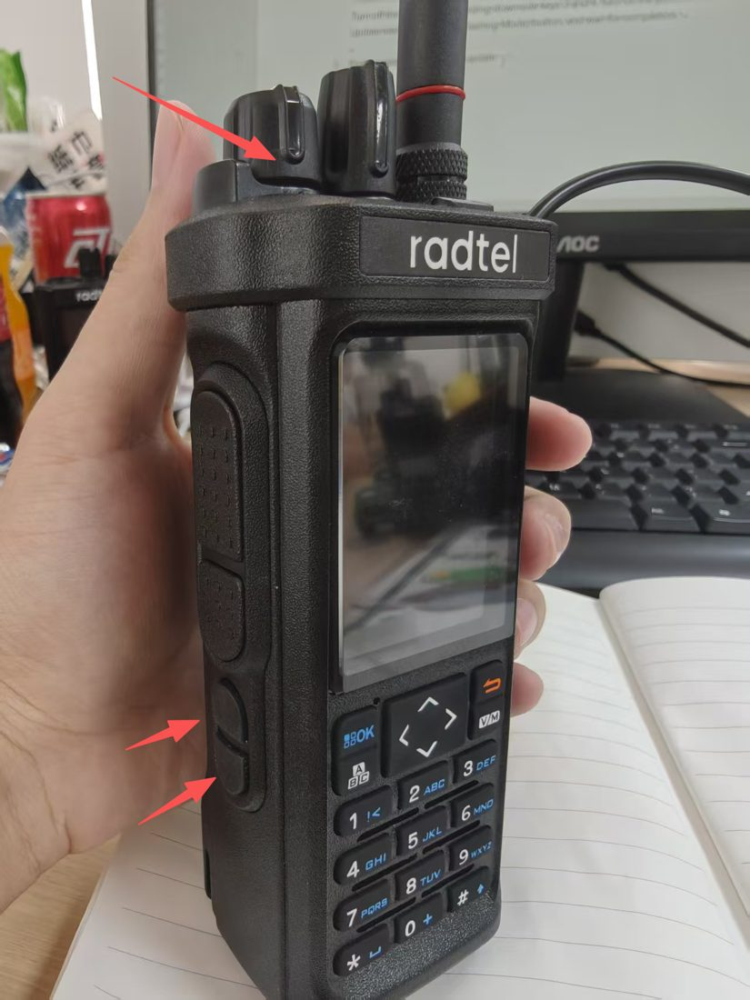
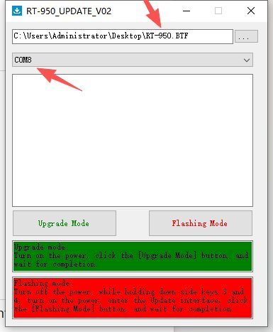
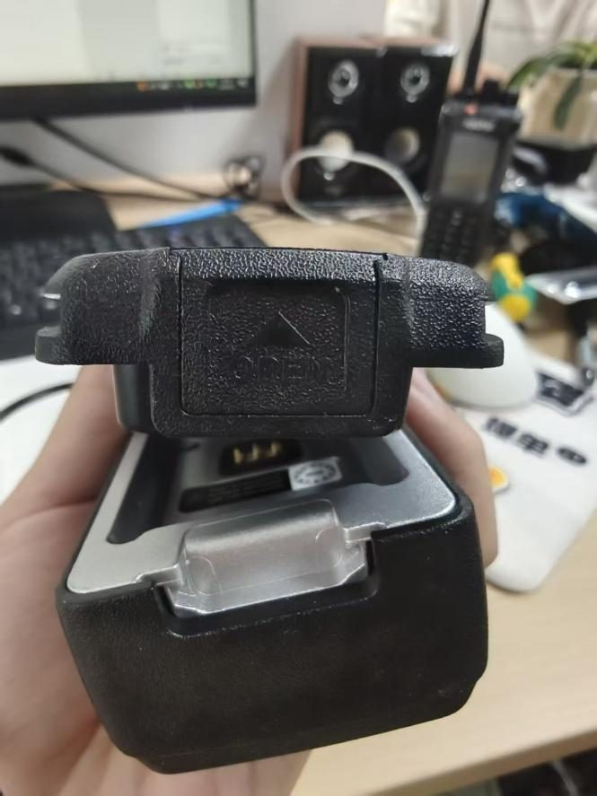

# RT-950 CPS

A Linux program for the Radtel RT-950 Pro. It reads and writes a codeplug over the programming cable, and it edits that codeplug as a `.950pro` file. One Rust binary does the work. It does not start the OEM Windows program, Mono, or Python.

The photographs in this guide are taken from Radtel’s update sheet, “Instruction to update Radtel RT-950 or RT-950 PRO” (`re/firmware/reference firmware/950Instruction.pdf`). That sheet is about firmware. It is included here so the radio, the side keys, and the updater are recognizable.

## 1. What you are looking at

The window has one bar across the top and six pages under it.

The bar holds the serial port, Read radio, Write radio, Open, Save, the callsign, Dark, and Log. The port on this machine is usually `/dev/ttyUSB0`. The callsign is the APRS callsign stored in the open codeplug. `N0CALL` is shown as unset. A blank callsign is rejected, because the radio would otherwise keep the previous six letters.

The pages are Global, APRS, Channels, Shortwave, AM, and FM. Channels is the page that opens. A `.950pro` file passed on the command line opens at startup. A second argument can name the page: `global`, `aprs`, `shortwave`, `am`, or `fm`.

Dark switches the theme. Log opens the transfer text. A timeout, `TOOVER`, `MODELERR`, `EXCABORT`, or `MANCANC` opens a reminder to power-cycle the radio.

## 2. Starting the program

After `tools/usb-stick/setup.sh`, the program lives in `~/Applications/rt950pro`. Start it from the RT-950 CPS menu entry, from `~/bin/rt950pro`, or by opening a `.950pro` file. The same folder contains this guide as `RT-950-CPS.pdf`.

The account that opens the cable needs to be in the `dialout` group. `setup.sh` offers to add that group. The new membership applies after you log out and back in. Removing the program with `uninstall.sh` does not remove the group and does not remove packages.

Quit the program before another tool opens the same cable. Listen on the APRS page holds the port until you press Stop, or until Read, Write, or a boot-picture send closes it.

## 3. The .950pro file, and an old .dat

The file this program edits is `.950pro`. It is pretty-printed JSON, one trailing newline, using the field names of the OEM codeplug (`channelData`, `funConfigData`, `aprsData`, and the rest). Open loads it. Save writes it. Save does not invent a sibling `.dat`.

A `.dat` file is a Windows .NET object written by the OEM CPS (`KDH.RadioData`). This window does not decode that object. Choosing a `.dat` in the Open dialog leaves the file unopened and says to open a `.950pro`. Saving onto a `.dat` name is refused the same way.

To bring an existing `.dat` across:

1. Write that file to the radio with the OEM CPS.
2. Connect the programming cable and press Read radio in this program.
3. Press Save and store the result as a `.950pro`.

From then on, this program can read and write that codeplug without the OEM CPS. The `.dat` itself stays a copy you can keep for the OEM program.

## 4. Reading and writing the radio

Put the radio in programming range of the cable, set the port, and press Read radio. The status line counts the blocks. When the read finishes, the channels replace whatever was on screen. The program does not save that result by itself. Press Save when you want a file.

A read puts FM transmit back on ordinary FM memories. The radio stores that flag in one bit and returns it as receive-only. AIS memories, and memories with an empty frequency, stay receive-only. The status line says how many memories were restored.

Write radio does not program the radio on the first click. A panel asks you to confirm the port and the channels on screen. Cancel leaves the radio alone. Write needs a codeplug already open. With nothing open, the bar says to open a `.950pro` first.

Read and Write both speak the session in the appendix. They do not flash firmware, and they do not write a raw memory dump beside the codeplug.

## 5. Channels

The radio holds 990 channels, arranged as 10 zones of 99. The zone tabs follow `arrayZoneName`. An older file with a different name list is split the same way: the names decide how many zones you see.

The top of the page shows the selected frequency, the service that frequency falls in, and the channel name. Under that is a dial for the channels in the current zone. The list under the dial is one row per channel: name, receive, transmit, bandwidth, power, and mode. Click a row to edit it.

The inspector on the right is the rest of that channel. The transmitter is FM on every memory. The mode choices are FM, FM receive only, and AM receive only. AM receive refuses the PTT. A name is at most 12 characters. An empty receive frequency is `000.00000`.

Tone fields take `OFF`, a CTCSS frequency such as `110.9`, or a DCS code such as `D023N`. The code has to be one of the 210 codes in the radio’s table.

## 6. Global settings

Global is four blocks on one scrolling page.

VFO A, VFO B, and VFO C each have a receive frequency, tones, offset, power, bandwidth, and step. A VFO frequency is stored as eight decimal digits. `400.12500` is those digits in order, which is a different layout from a memory channel.

Radio holds the options that used to live in the OEM “fun” screen: squelch, save mode, VOX, backlight, scan, display, alarm, the side keys, and which zone each band opens on. The radio shows 10 zones. Side key 1 short press has one extra choice, PTTC. Long presses use the longer list (None, Radio, VOX, Search, and the rest). The photograph below is the radio the OEM sheet uses to point at the top key and the two side keys. In this program those keys are the Side 1, Side 1 long, Side 2, and Side 2 long rows.

DTMF holds the current ID and 22 code groups. The ID is up to five characters from `0-9`, `A-D`, `*`, and `#`. A code group is up to six of those characters.

Boot picture sends one uncompressed 24-bit BMP, 240 by 320 pixels. Choose the file, then Send to radio, then confirm. The radio keeps the image. This program cannot read it back, so keep the BMP.

## 7. APRS

The APRS page edits the station, the fixed position, the beacon, and the path. The callsign at the top of the window is the same field.

Listen opens the radio’s USB KISS port at 115200 and plots stations within 100 miles of the map center. The center is the fixed position when that position is set, otherwise a station the radio has already heard. The program does not invent a center. The GPS sentences stay inside the radio. This page does not read them.

Beacon writes one KISS position frame to that port. It does not key the transmitter. The radio’s own beacon is a long press of the side key that is set to Beacon TX.

Stop Listen before you expect the cable to be free for something else. Read, Write, and the boot picture close Listen themselves.

## 8. Shortwave, AM, and FM

These three pages are the broadcast and shortwave memories, 16 slots each. Slot 0 is the live tuner. The list labels it Now. The other rows are Memory 1 through Memory 15.

Each page shows the tuned frequency, a dial, the memory list, and an editor for the selected slot. Shortwave adds bandwidth and the beat-frequency offset. AM and shortwave have a step and a receive gain. The mode for this receiver is FM, AM, USB, or LSB, separate from the FM-only transmit flag on a memory channel.

An empty FM slot 0 is stored as 64.00 MHz. An empty AM slot 0 is stored as 153 kHz. An empty shortwave slot 0 is stored as 150 kHz. That is how the radio’s own reader fills a zero.

## 9. Firmware is a different job

This program does not load a `.BTF` file and does not recover a radio that is stuck in the updater. Radtel’s sheet is that other job. The window it tells you to open is RT-950 EnUPDATE, with Upgrade Mode and Flashing Mode. The sheet says the RT-950 and the RT-950 Pro use the same updater.

If an update stops halfway, the sheet says to pull the battery, wait ten seconds, and hold side keys 3 and 4 while turning the radio on. That opens the update screen. Flashing Mode is the button the sheet tells you to press next. The battery latch in the sheet looks like this.

Codeplug Read and Write never enter that screen. They use the session in the appendix.

## Appendix A. The serial protocol

The programming cable is a CH340 USB serial adapter. The session is 115200 bits per second, 8 data bits, no parity, one stop bit. Before the first byte, the program clears DTR and RTS. The boot-picture upload does the opposite and asserts those two lines, so the two sessions are not interchangeable.

Firmware update is a third session. Its frames start with `0xAA` and end with `0x55`. Nothing in a codeplug read or write uses that framing.

### Opening the radio

The computer sends the sixteen letters `PROGRAMBT9000U`. The radio answers with one byte, `0x06`, which means yes. The computer sends `F` and reads 16 status bytes. It sends `M` and reads 12 bytes. On this radio those 12 bytes are the letters `RT-950` followed by spaces. The computer then sends `SEND` plus 21 parameter bytes, and the radio answers `0x06` again.

`SEND` also picks the scramble key for the rest of the session. Byte 4 of that packet selects one entry from a table of 20 four-character keys that shipped inside the OEM program. This program sends one fixed `SEND`, so the key is the four characters space, `E`, `I`, `Y`. Every 128-byte payload is combined with that key, starting over at the first character for each block. The operation is exclusive-or, and it undoes itself, so the same function reads and writes. A byte is left unchanged when the key character is a space, when the data byte is `0x00` or `0xFF`, or when the data byte already equals the key character or its inverse.

### The memory picture

The radio’s settings, apart from APRS, are a flat picture of 54016 bytes (`0xD300`). The computer moves it in blocks of 128 bytes. There are 271 blocks. The addresses are `0x0000`, `0x0080`, `0x0100`, and so on through `0x7F80`, then a short high list:

| Address | What is stored there |
| --- | --- |
| `0x0000`–`0x7BBF` | 990 channels, 32 bytes each |
| `0x8000` | VFO A, B, and C |
| `0x9000` | Radio options (squelch, keys, zones, scan limits) |
| `0xA000` | DTMF identity and code groups |
| `0xB000` | Shortwave, AM, and FM frequencies |
| `0xC000` | Zone names |
| `0xD000` | Shortwave, AM, and FM names |

Gaps between those high addresses are left as `0xFF` and are not sent. 31680 channel bytes are not a multiple of 128, so the last channel block contains the last channels and then empty `0xFF` bytes up to the next boundary.

A read of one block is four plain bytes: the letter `R`, the address with the high byte first, and the length `0x80`. The radio echoes those four bytes and then sends 128 scrambled bytes. The program unscrambles them and stores them at that address.

After the last of the 271 blocks, the computer sends `T`, address `0x0000`, length `0x80`. The radio answers the same way: four echoed bytes and 128 scrambled bytes. That block is APRS. It is not inside the 54016-byte picture. The computer then sends the single letter `E`. If `E` fails, the channels are already in hand, so the read is kept and the log records the warning.

### Writing

A write uses the same opening, the same 271 addresses, and the same key. Each block on the wire is 132 bytes. The first four are plain: the letter `W`, the address, and `0x80`. The next 128 are the scrambled payload. The radio answers `0x06` after every block. APRS is one more 132-byte frame, with the letter `X` instead of `W`, at address 0. Then the computer sends `E`. A failure of that last `E` fails the write.

The header is not scrambled. Scrambling the whole 132 bytes, or cutting the stream into 100-byte USB chunks in software, does not match what the radio accepts. The operating system may split a 132-byte write into smaller USB packets. That split is the host controller’s business. The program still hands the radio one 132-byte frame.

### What one channel looks like

Thirty-two bytes:

| Bytes | Contents |
| --- | --- |
| 0–3 | Receive frequency, BCD, least-significant pair first |
| 4–7 | Transmit frequency, same encoding |
| 8–9 | Receive tone |
| 10–11 | Transmit tone |
| 12–14 | Signalling group, PTT ID, power and scrambler |
| 15 | Bandwidth, scan, busy lock, and receive mode |
| 16–19 | FHSS code, or `0xFF` when empty |
| 20–31 | Name, GB2312, up to 12 bytes, stopped by `0x00` or `0xFF` |

`26.96500` is the four bytes `00 65 69 02`. `145.20000` is `00 00 52 14`. A receive frequency of all `0x00` or all `0xFF` means the channel is empty. The editor shows that as `000.00000`.

A CTCSS tone is an integer with the decimal point one digit from the right, stored low byte then high byte. `110.9` is `55 04`. A DCS code is an index into the 210-entry table, in the first byte, with `0x00` in the second. `D023N` is index 1, stored as `01 00`. `OFF` is `00 00`.

The receive-mode field keeps only its low bit on the way back out of the radio. FM transmit is stored as 2 and comes back as 0. This program restores 2 on a real FM memory after a read. It does not do that for AIS or for a blank frequency.

### A few numbers that move on the way through

A VFO frequency is not BCD. `400.12500` is the eight bytes `04 00 00 01 02 05 00 00`, each one a decimal digit. The VFO learn-FHSS flag always reads back as 0.

VFO scan limits are a 16-bit number. The radio’s reader forces that number into the range 18 through 999. A file that stores 0 comes back from a read as 18.

FM memory 0, when the stored frequency is 0, becomes 6400, which is 64.00 MHz. AM memory 0 becomes 153. Shortwave memory 0 becomes 150.

Reserved bytes that the OEM reader never copies into the JSON stay `0xFF` in the radio picture and 0 in a document that came from a read. A round trip is compared by name, frequency, tone, power, bandwidth, and scan. It is not a byte-for-byte copy of the picture.

### The file and the wire

The `.950pro` file is the JSON document. The radio never sees it. Read builds the document from the picture plus the APRS block. Write turns the document back into that picture and that block. The window edits the document in memory. Save is the only thing that writes the file.
